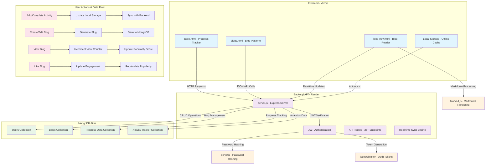

# FocusFlow - Track Your Progress, Master Your Journey

[](https://my-focus-flow.vercel.app/)
[](https://github.com/anupam6335/FocusFlow/releases)
[](https://my-focus-flow.vercel.app/)
[](https://daily-tracker-upst.onrender.com/)
[](LICENSE)
[](package.json)
[](https://mongodb.com)

## 🌟 The Story Behind FocusFlow

> "I almost gave up on my coding journey. The loneliness of learning, the invisible progress, the forgotten insights—it was crushing. Then I built FocusFlow to save myself, and it ended up saving my journey."

FocusFlow was born from frustration. Like many developers, I struggled with:

- **📉 Motivation rollercoaster** - Bursts of energy followed by weeks of silence
- **🧠 Knowledge evaporation** - Brilliant insights lost because I didn't write them down
- **📊 Progress invisibility** - No way to see how far I'd actually come
- **👥 Learning isolation** - Coding alone without community or shared wisdom

One evening, after solving a tough algorithm problem, I realized: *the solution wasn't just in the code—it was in the process.* That's when FocusFlow transformed from an idea into a mission: **make consistency visible, rewarding, and shared.**

---

## 🎯 What Problem Does FocusFlow Solve?

### The Developer's Dilemma
- **89% of developers** struggle with consistent learning habits
- **Progress amnesia** - forgetting what you've accomplished kills motivation
- **Isolated learning** - coding alone without community support
- **Unshared insights** - brilliant solutions that never help anyone else

### Our Solution
FocusFlow transforms learning from a solo struggle into a celebrated journey:

- **📊 Visual Progress Ecosystem** - See your growth through heatmaps, streaks, and analytics
- **📝 Integrated Knowledge Sharing** - Turn your insights into helpful blogs for others
- **🔥 Gamified Consistency** - Streaks and achievements that make practice addictive
- **👥 Community Wisdom** - Learn from others' journeys while documenting your own

---

## 🎨 Project Preview

### 📊 Main Dashboard - Your Progress Command Center


*Experience the clean, intuitive interface where your coding journey comes to life. Track daily progress, visualize consistency, and celebrate achievements.*

### 📝 Blogging Platform - Share Your Wisdom


*Transform your learning insights into valuable content. Write with full Markdown support, engage with the community, and build your developer reputation.*

### 🔍 Blog Reader - Immersive Learning Experience


*Dive deep into community knowledge with our beautiful reading experience. Clean typography, syntax highlighting, and responsive design make learning enjoyable.*

---

## 🔄 System Architecture & Workflow

### 🏗️ Complete System Flow Diagram



### 📈 Real-time Data Flow Explanation

#### 🎯 **Daily Progress Tracking Flow**
```
User Action → Frontend (index.html) → Local Storage → Backend API → MongoDB → Analytics Update
     ↓              ↓                   ↓              ↓              ↓           ↓
Complete Task → Update UI Immediately → Cache Data → Sync with Server → Save Progress → Update Heatmap
```

**What happens when you complete a task:**
1. **Instant UI Update** - Checkbox toggles immediately with visual feedback
2. **Local Storage Cache** - Data saved locally for offline access
3. **Background Sync** - Automatic synchronization with backend (2-second debounce)
4. **Database Persistence** - Progress saved to MongoDB with version control
5. **Analytics Recalculation** - Streaks, heatmap, and statistics updated in real-time
6. **Achievement Check** - System checks for 5+ completed tasks to trigger celebrations

#### 📝 **Blog Management Flow**
```
Create Blog → Generate Slug → Save Draft → Publish → Update Lists → Track Engagement
     ↓             ↓             ↓          ↓          ↓             ↓
Rich Editor → URL-Friendly ID → Auto-save → MongoDB → Blog Feeds → Views/Likes
```

**What happens when you publish a blog:**
1. **Content Creation** - Write with Markdown editor in `blogs.html`
2. **Slug Generation** - Automatic URL-friendly title conversion (e.g., "My Coding Journey" → "my-coding-journey")
3. **Privacy Settings** - Choose public (community visible) or private (personal notes)
4. **Database Storage** - Full content saved to Blogs collection
5. **List Updates** - Appears in "My Blogs" tab immediately, "All Blogs" if public
6. **Engagement Tracking** - View counters and like system activated

#### 👁️ **Blog Reading & Engagement Flow**
```
Visit Blog → Load Content → Render Markdown → Track View → Update Popularity → Show in Feeds
     ↓           ↓             ↓             ↓           ↓              ↓
blog-view.html → API Fetch → Marked.js → View Counter → Score Calc → Popular Tab
```

**What happens when someone reads your blog:**
1. **Page Load** - User visits `/blogs/your-blog-slug`
2. **Content Fetch** - `blog-view.html` calls API to get blog data
3. **Markdown Rendering** - Raw Markdown transformed to beautiful HTML
4. **View Tracking** - Automatic view counter increment (prevents duplicate counts)
5. **Popularity Update** - Popularity score recalculated: `(likes + views)`
6. **Feed Placement** - Blog may appear higher in "Popular" tab rankings

#### 🔄 **Real-time Sync Architecture**
```
Frontend Changes → Debounce (2s) → Conflict Check → Smart Merge → Database Update
     ↓               ↓              ↓              ↓            ↓
User Input → Wait for Pause → Version Compare → Auto-Resolve → Persist Changes
```

**How synchronization protects your data:**
1. **Debounced Saving** - Waits 2 seconds after last change to prevent API spam
2. **Conflict Detection** - Checks if server has newer version of your data
3. **Intelligent Merging** - Automatically combines compatible changes
4. **User Resolution** - Prompts for manual resolution if significant conflicts
5. **Version Control** - Every change tracked with timestamp and version number

---

## ✨ Features That Make a Difference

### 🎯 Core Progress Tracking
- **📅 Intelligent Day Management** - Focus on today while seeing your historical journey
- **✅ Achievement Celebrations** - Confetti animations and dark green status for 5+ completed tasks
- **🏷️ Smart Tagging System** - Color-coded organization with auto-generated colors
- **🔗 Advanced Link Management** - Convert URLs into beautiful, clickable tags
- **🎨 Adaptive Theme System** - Seamless dark/light mode switching

### 📝 Integrated Blogging Platform
- **✍️ Rich Markdown Editor** - Full Markdown support with live preview and syntax highlighting
- **👁️ Real-time View Tracking** - Watch your insights help others in real-time
- **❤️ Engagement Ecosystem** - Like system with anti-self-like protection
- **🔒 Granular Privacy** - Public blogs to share wisdom, private blogs for personal notes
- **📊 Popularity Analytics** - Automatic ranking based on views + likes
- **🏷️ Smart Categorization** - Tag blogs for discoverability and organization

### 🔐 Enterprise-Grade Infrastructure
- **☁️ Real-time Multi-device Sync** - Continue where you left off on any device
- **🔒 Military-Grade Auth** - JWT tokens with 230-day sessions
- **⚡ Intelligent Conflict Resolution** - Smart merging for simultaneous edits
- **📱 Offline-First Architecture** - Full functionality without internet
- **🔐 Secure Password Recovery** - OTP-based reset system

### 📊 Advanced Analytics & Visualization
- **📈 GitHub-Style Heatmap** - Beautiful activity visualization that tells your story
- **🔥 Streak Intelligence** - Current streak, max streak, and daily averages
- **🎯 Progress Momentum** - Watch your consistency compound over time
- **💪 Habit Formation Engine** - Scientifically-backed consistency tools

---

## 🏗️ Project Architecture

### Frontend (Vercel)
```
🌐 https://my-focus-flow.vercel.app/
├── index.html (Main Progress Tracker with Analytics)
├── blogs.html (Community Blogging Platform)
├── blog-view.html (Advanced Blog Reader with Markdown)
├── responsive.css (Mobile-First Responsive Design)
└── FocusFlow.ico (Brand Identity)
```

### Backend (Render)
```
⚙️ https://daily-tracker-upst.onrender.com/
├── server.js (Express API with 25+ Endpoints)
├── MongoDB (User Data, Blogs, Analytics)
├── JWT Authentication System
└── Real-time Sync Engine
```

### Key Technical Stack
- **Frontend**: Vanilla JavaScript, CSS3, HTML5 (Zero dependencies for maximum performance)
- **Backend**: Node.js, Express.js, MongoDB, JWT, bcryptjs, Marked.js
- **Deployment**: Vercel (Frontend), Render (Backend)
- **Markdown**: Marked.js for rich blog content rendering

---

## 🚀 Quick Start - 30 Seconds to Productivity

### 🌐 Use the Live Application
**No installation required!** Start tracking immediately:

👉 **[Live App: https://my-focus-flow.vercel.app/](https://my-focus-flow.vercel.app/)**

### Quick Start Steps:
1. **Visit** the live application
2. **Create account** (5-second process)
3. **Start with Day 1** - pre-loaded with curated example questions
4. **Check off completed items** - watch your heatmap come alive
5. **Write your first blog** - share your progress and help others
6. **Explore community blogs** - learn from fellow developers' journeys

---

## 💻 Developer Setup

### Prerequisites
- Node.js (v14 or higher)
- MongoDB instance (local or Atlas)

### Local Development

1. **Clone and setup**
```bash
git clone https://github.com/anupam6335/FocusFlow.git
cd FocusFlow
npm install
```

2. **Environment configuration**
```env
# .env file
MONGODB_URI=your_mongodb_connection_string
PORT=3000
NODE_ENV=development
JWT_SECRET=your-super-secret-jwt-key
```

3. **Start development servers**
```bash
# Backend (with hot reload)
npm run dev

# Frontend - serve static files
python -m http.server 8000
# or
npx http-server
```

4. **Access your local environment**
- Frontend: `http://localhost:8000`
- Backend API: `http://localhost:3000/api`

---

## 📁 Project Structure Deep Dive

### File-by-File Explanation

```
FocusFlow/
├── 🎯 Core Application
│   ├── index.html          # Main progress tracker with advanced analytics
│   ├── blogs.html          # Community blogging platform with tabs
│   ├── blog-view.html      # Individual blog reader with full Markdown
│   └── responsive.css      # Mobile-first responsive design system
├── ⚙️ Backend & Configuration
│   ├── server.js           # Express server with 25+ API endpoints
│   ├── package.json        # Dependencies and deployment scripts
│   ├── render.yaml         # Render deployment configuration
│   └── vercel.json         # Vercel deployment configuration
├── 🔐 Security & Data
│   └── .env               # Environment variables (template)
└── 📄 Documentation
    ├── LICENSE            # MIT License
    └── README.md          # This comprehensive guide
```

### Key Technical Implementation Details

**Smart Conflict Resolution** (`server.js`)
- Intelligent data merging for simultaneous edits
- Version-based conflict detection with 2-second grace period
- Auto-merge for compatible changes, user resolution for conflicts

**Real-time Sync Engine**
- Debounced synchronization (2-second intervals)
- Offline-first design with background sync
- Progressive enhancement for poor connectivity

**Blogging Platform Architecture**
- Slug-based URL routing for SEO-friendly blog links
- Markdown parsing with syntax highlighting and sanitization
- Real-time view counting and engagement analytics
- Author-based permission system with privacy controls

---

## 🎨 UI/UX Features

### Progress Tracker (`index.html`)
- **Editable Today-Only System** - Prevents retrospective cheating, focuses on present momentum
- **Visual Status Indicators** - Emoji-based mood feedback with achievement colors
- **Celebration Engine** - Confetti animations and popups for 5+ completed tasks
- **Heatmap Integration** - GitHub-inspired activity visualization that grows with you

### Blogging Platform (`blogs.html`, `blog-view.html`)
- **Triple-Tab Interface** - All Blogs, My Blogs, and Popular sections
- **Real-time Engagement** - Live like counts, view tracking, and popularity scores
- **Rich Markdown Editor** - WYSIWYG-style editing with instant preview
- **Mobile-Optimized Reading** - Responsive design for comfortable mobile consumption

---

## 🔌 API Endpoints

### Authentication & Users
- `POST /api/register` - Secure user registration with validation
- `POST /api/login` - JWT-based authentication
- `POST /api/forgot-password` - Password reset initiation with OTP
- `POST /api/reset-password` - Secure password reset completion

### Progress Data Management
- `GET /api/data` - Retrieve user progress with versioning
- `POST /api/data` - Save progress with intelligent conflict resolution
- `POST /api/force-sync` - Manual synchronization trigger

### Blog Management
- `GET /api/blogs` - Paginated blog listings with filters
- `GET /api/blogs/all` - Public blogs feed for community learning
- `GET /api/blogs/my` - User's personal blogs (public + private)
- `GET /api/blogs/popular` - Popularity-ranked blogs (views + likes)
- `POST /api/blogs` - Create new blog with slug generation
- `PUT /api/blogs/:slug` - Update blog content with slug regeneration
- `DELETE /api/blogs/:slug` - Secure blog deletion
- `POST /api/blogs/:slug/like` - Like/unlike with anti-self-like protection
- `POST /api/blogs/:slug/view` - Real-time view tracking

### Analytics & Activity
- `GET /api/activity-tracker` - Comprehensive progress analytics
- `POST /api/activity-tracker` - Save activity data with auto-sync

---

## 🚀 Deployment Guide

### Frontend Deployment (Vercel)
```bash
# Automatic deployment via Vercel
npm run build
# Deploys to: https://my-focus-flow.vercel.app/
```

### Backend Deployment (Render)
```yaml
# render.yaml configuration
services:
  - type: web
    name: focusflow-backend
    env: node
    buildCommand: npm install
    startCommand: npm start
```

### Environment Variables Production Setup
```env
MONGODB_URI=mongodb+srv://...
PORT=3000
NODE_ENV=production
JWT_SECRET=your-production-secret-key
```

---

## 🐛 Troubleshooting & Common Issues

### Blog View Tracking
**Problem**: Blog views not incrementing properly  
**Solution**: Ensure `POST /api/blogs/:slug/view` endpoint is called on blog view. Check browser console for CORS errors and verify the slug parameter matches.

### Responsive Header Issues
**Problem**: Navigation breaks on mobile devices  
**Solution**: Verify `responsive.css` media queries are correctly structured. Test with Chrome DevTools device simulation.

### Popular Blogs Section
**Problem**: Popular tab shows incorrect or no content  
**Solution**: Check popularity score calculation: `(likes + views)`. Verify both fields exist in blog documents.

### Sync Conflicts
**Problem**: "Conflict detected" messages during data save  
**Solution**: System auto-resolves most conflicts. Use "Sync Now" button for force synchronization. Conflicts occur when server data is significantly newer.

### Markdown Rendering
**Problem**: Blog content not formatting correctly  
**Solution**: Ensure Marked.js CDN is loaded. Verify blog content uses proper Markdown syntax. Check console for parsing errors.

### Self-Like Prevention
**Problem**: Cannot like own blogs  
**Solution**: This is intentional! FocusFlow encourages community engagement, not self-promotion.

---

## 🔮 Future Roadmap

### 🚀 Coming Soon
- [ ] **Mobile App** - React Native version for iOS/Android
- [ ] **Advanced Analytics** - Learning pace predictions and personalized insights
- [ ] **Community Features** - Follow other learners, collaborative goals, mentorship
- [ ] **Export Capabilities** - PDF progress reports, GitHub contributions sync

### 🎯 Planned Enhancements
- [ ] **Custom Question Templates** - Pre-built learning paths for popular tech stacks
- [ ] **Integration API** - Connect with LeetCode, HackerRank, and coding platforms
- [ ] **Advanced Blog Features** - Comments, rich media embedding, code sandboxes
- [ ] **Learning Reminders** - Smart notification system based on your patterns

### 💡 Vision
Transform FocusFlow into the ultimate learning companion that not only tracks progress but actively helps users learn more effectively through AI-powered recommendations and community wisdom sharing.

---

## 🤝 Contributing

We believe in the power of community-driven development! Here's how you can help:

### Areas Needing Contribution
- **UI/UX Improvements** - Especially mobile experience and accessibility
- **Testing** - Cross-browser compatibility, performance optimization
- **Documentation** - Tutorials, video guides, API documentation
- **Feature Development** - Pick from our roadmap issues

### Development Process
1. Fork the repository
2. Create a feature branch (`git checkout -b feature/amazing-feature`)
3. Commit your changes (`git commit -m 'Add amazing feature'`)
4. Push to the branch (`git push origin feature/amazing-feature`)
5. Open a Pull Request

---

## 📄 License

This project is licensed under the MIT License - see the [LICENSE](LICENSE) file for details.

## 🌟 Support & Community

- **🚀 Live Application**: [https://my-focus-flow.vercel.app/](https://my-focus-flow.vercel.app/)
- **🐛 Bug Reports**: GitHub Issues
- **💡 Feature Requests**: GitHub Discussions
- **📚 Documentation**: This README + comprehensive inline code comments

---

## 🎯 The Real Impact

> "I went from inconsistent practice to a 45-day coding streak. FocusFlow didn't just track my progress—it built my discipline. The blogging feature turned my scattered notes into helpful guides that actually helped other developers. This isn't just an app; it's a learning companion."
> - Early User Testimonial

FocusFlow transforms the lonely journey of skill acquisition into a visible, celebrated, and shared experience. It's the difference between learning in the dark and learning with a community cheering you on.

---

<div align="center">

## 🚀 Ready to Transform Your Learning Journey?

### 🌐 **Start Your Journey Today:**
# [https://my-focus-flow.vercel.app/](https://my-focus-flow.vercel.app/)

**Your future self will thank you for starting today.**

*"The best time to plant a tree was 20 years ago. The second best time is now."* - Chinese Proverb

⭐ **Star this repo if FocusFlow helps your journey!**

</div>

---

**📈 Your progress story starts with one click. What will you accomplish today?** 🚀
