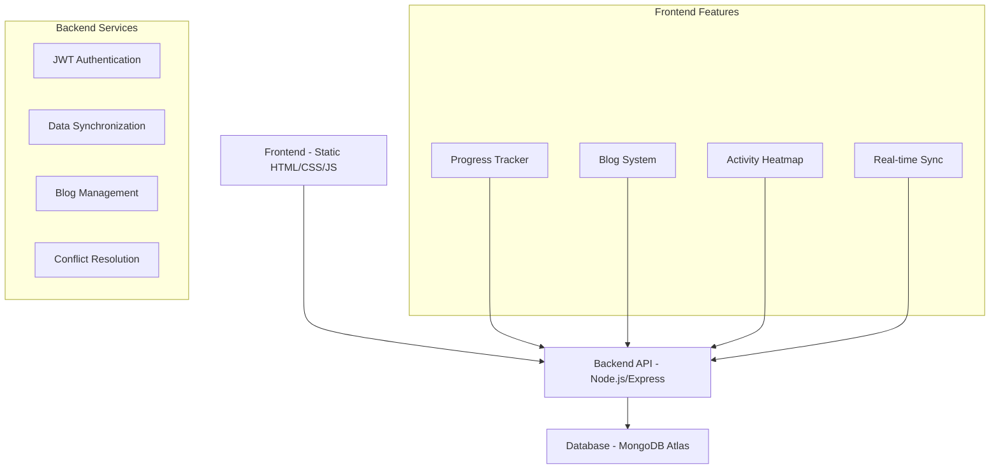

# FocusFlow - Track Your Progress, Master Your Journey

<div align="center">

 <!-- Replace with actual logo -->

[](https://github.com/anupam6335/FocusFlow)
[](https://github.com/anupam6335/FocusFlow/releases)
[](https://daily-tracker-upst.onrender.com/)
[](https://nodejs.org)
[](https://expressjs.com)
[](https://mongodb.com)
[](LICENSE)
[](https://github.com/anupam6335/FocusFlow)

**🌐 Live Website: [https://daily-tracker-upst.onrender.com/](https://daily-tracker-upst.onrender.com/)**

*"The compound effect of small, consistent efforts creates extraordinary results"*

[🚀 Quick Start](#-quick-start) • [📖 Features](#-features) • [🏗️ Architecture](#️-architecture) • [💻 Development](#-development)

</div>

## 🎯 What is FocusFlow?

> **Ever felt overwhelmed tracking your coding progress? Lost motivation because you can't see your growth?** 

FocusFlow is your personal coding companion that transforms chaotic learning into structured mastery. Born from the frustration of scattered notes and forgotten progress, it's designed for developers who believe in **consistent growth through daily practice**.

```ascii
📈 Your Journey Visualized:
Day 1: 2 problems → Day 30: 150+ problems solved
     ┌─ Consistency Heatmap ──────────────────────┐
     │  ██  ██  ██  ██  ██  ██  ██  Weekly Growth │
     │  ██  ██  ██  ██  ██  ██  ██  │            │
     │  ██  ██  ██  ██  ██  ██  ██  ▼ Daily Habits│
     │  ██  ██  ██  ██  ██  ██  ██  Building     │
     └─ Streak: 45 days 🔥 ───────────────────────┘
```

## ✨ Features That Transform Your Journey

### 🎯 Core Progress Tracking

| Feature | What It Does | How You Use It |
|---------|--------------|----------------|
| **📅 Daily Progress Management** | Organizes your learning day-by-day | Add questions, track completion, build consistency |
| **✅ Smart Item Management** | Full CRUD for learning items | Click "+ Add Question", edit text, add links, delete when needed |
| **🏷️ Tag System** | Color-coded categorization | Type tag name + Enter, automatic color assignment |
| **🔗 Advanced Link Management** | Stores references as clickable tags | Paste URLs, they become beautiful, clickable tags |

### 🔐 Advanced Cloud Capabilities

| Feature | User Experience | Technical Magic |
|---------|-----------------|-----------------|
| **☁️ Real-time Sync** | Your progress everywhere | JWT auth + MongoDB + intelligent conflict resolution |
| **🔒 Secure Auth** | Simple login/register | bcryptjs password hashing + 230-day sessions |
| **⚡ Smart Conflict Resolution** | No data loss ever | Version control + time-based merging + auto-recovery |
| **📱 Offline-First** | Works without internet | LocalStorage fallback + background sync |

### 📊 Progress Analytics & Visualization

```ascii
Your Progress Dashboard:
┌─ Analytics ──────────────────────────────────┐
│  Current Streak: 12 days 🔥                  │
│  Total Solved:  245 problems                 │
│  Daily Average: 4.2 problems/day             │
│  Max Streak:    45 days 🏆                   │
└──────────────────────────────────────────────┘

Consistency Heatmap (GitHub-style):
Jan ██▒▒▒▒██▒▒██▒▒██▒▒██▒▒██▒▒  Less
Feb ██▒▒██▒▒██▒▒██▒▒██▒▒██▒▒██▒▒
Mar ██▒▒██▒▒██▒▒██▒▒██▒▒██▒▒██▒▒ More
```

### 🆕 Blogging Community Platform

| Feature | Community Impact | How It Works |
|---------|------------------|--------------|
| **📝 Markdown Blogging** | Share your journey | Write in Markdown, beautiful rendering with `marked.js` |
| **👥 Public/Private Blogs** | Control your audience | Toggle visibility, private for notes, public for sharing |
| **❤️ Engagement System** | Build community | Like blogs (no self-liking!), view tracking |
| **🏷️ Tagging & Discovery** | Find relevant content | Categorize with tags, browse by popularity |

### 🎉 Gamification & Motivation

| Feature | Psychological Boost | Implementation |
|---------|---------------------|----------------|
| **🔥 Streak Tracking** | Don't break the chain! | Calculates consecutive days with activity |
| **🎊 Achievement Celebrations** | Dopamine hits for progress | Confetti + sounds when hitting 5/10 problems daily |
| **📈 Progress Momentum** | Visual growth proof | GitHub-style heatmap colors intensify with activity |
| **💪 Habit Formation** | Build coding routine | Daily tracking + analytics + consistency rewards |

## 🏗️ Architecture

### System Overview



### Tech Stack Deep Dive

| Layer | Technology | Why We Chose It |
|-------|------------|-----------------|
| **Frontend** | Vanilla JS, HTML5, CSS3 | Zero dependencies, lightning fast, full control |
| **Backend** | Node.js + Express | JavaScript full-stack, async capabilities |
| **Database** | MongoDB + Mongoose | Flexible schema for evolving features |
| **Auth** | JWT + bcryptjs | Stateless, scalable, secure |
| **Markdown** | marked.js + DOMPurify | Safe client-side rendering |
| **Deployment** | Render.com | Simple, reliable, free tier available |

## 🚀 Quick Start

### 🌐 For Users: Instant Access

**Just want to track your progress?** No installation needed!

1. **Visit:** [https://daily-tracker-upst.onrender.com/](https://daily-tracker-upst.onrender.com/)
2. **Register** (30 seconds - username + password)
3. **Start tracking** immediately!
4. **Access anywhere** - automatically syncs across devices

> 💡 **Pro Tip:** Bookmark the site and make it your daily coding homepage!

### 💻 For Developers: Local Setup

#### Prerequisites
```bash
node --version  # v14+ required
mongod --version  # MongoDB installed and running
```

#### Step-by-Step Setup

1. **Clone & Setup**
```bash
git clone https://github.com/your-username/FocusFlow.git
cd FocusFlow

# Install dependencies
npm install

# Environment configuration
cp .env.example .env
# Edit .env with your MongoDB and JWT secret
```

2. **Environment Variables** (`.env`)
```env
MONGODB_URI=mongodb://localhost:27017/focusflow
PORT=3000
JWT_SECRET=your-super-secret-key-change-in-production
NODE_ENV=development
```

3. **Run the Application**
```bash
# Development mode (auto-restart on changes)
npm run dev

# Production mode
npm start
```

4. **Access Your Local Instance**
```
Frontend: http://localhost:3000
API: http://localhost:3000/api
```

## 📖 User Guides

### 🎯 Getting Started with Progress Tracking

1. **Day 1 Setup** (2 minutes):
   - Login → See pre-loaded example questions
   - Click checkboxes as you complete problems
   - Watch your status change from 😞 to 😊

2. **Adding Your Content**:
   ```javascript
   // Click "+ Add Question" in today's column
   // Type your problem: "Reverse Linked List"
   // Add link: "https://leetcode.com/problems/reverse-linked-list/"
   // Press Enter - it's saved!
   ```

3. **Building Consistency**:
   - Return daily (streak tracking motivates you!)
   - Aim for 3+ problems to activate heatmap
   - Use tags to categorize (e.g., `#dp`, `#graph`, `#easy`)

### 📝 Mastering the Blog System

#### Writing Your First Blog

1. **Navigate to Blogs**: Click "📝 Blogs" in header
2. **Create New**: Click "Create Blog" button
3. **Compose**:
   ```markdown
   # My Binary Search Breakthrough
   
   Today I finally understood **binary search** patterns!
   
   ## Key Insights:
   - Left/right pointer movement
   - Termination conditions
   - O(log n) complexity in practice
   
   `Code Example:`
   ```javascript
   function binarySearch(arr, target) {
     let left = 0, right = arr.length - 1;
     while (left <= right) {
       const mid = Math.floor((left + right) / 2);
       // ... implementation
     }
   }
   ```
   ```

4. **Publish**: Choose public (share) or private (personal notes)

#### Engaging with Community

- **Like blogs** that help you (heart button)
- **Browse popular** content in "Popular" tab
- **Track views** to see your impact
- **Use tags** for discoverability

### 🔧 Advanced Features

#### Smart Sync Explained

```javascript
// How conflict resolution works:
User A edits offline → comes online
User B edited same item → CONFLICT!
System: "Let me intelligently merge these..."
Result: No data loss, both changes preserved!
```

#### Customizing Your Workflow

1. **Personal Links Section**:
   - Add frequently visited resources
   - One-click access during coding sessions
   - Perfect for documentation, cheat sheets

2. **Tag System Mastery**:
   - Color-coded automatic assignment
   - Filter and search capabilities
   - Progress analysis by category

## 🏗️ Codebase Navigation

### Project Structure
```
FocusFlow/
├── 📄 index.html          # Main progress tracker
├── 📄 blogs.html          # Blog listing/creation
├── 📄 blog-view.html      # Individual blog display
├── 🚀 server.js           # Express server + API routes
├── 📦 package.json        # Dependencies
└── 🔧 .env               # Environment configuration
```

### Key File Responsibilities

| File | Purpose | Key Features |
|------|---------|--------------|
| `index.html` | Main application | Progress tracking, heatmap, sync logic |
| `blogs.html` | Blog management | CRUD operations, markdown editor |
| `blog-view.html` | Blog display | Markdown rendering, like system |
| `server.js` | Backend API | Authentication, data sync, blog routes |

### API Endpoints

```javascript
// Authentication
POST   /api/register        // Create account
POST   /api/login           // User login
GET    /api/verify-token    // Session validation

// Data Management
GET    /api/data            // Fetch user progress
POST   /api/data            // Save progress (smart sync)
POST   /api/force-sync      // Manual synchronization

// Blog System
GET    /api/blogs           // List blogs (with pagination)
POST   /api/blogs           // Create new blog
GET    /api/blogs/:slug     // Get specific blog
PUT    /api/blogs/:slug     // Update blog
DELETE /api/blogs/:slug     // Delete blog
POST   /api/blogs/:slug/like // Like/unlike blog
POST   /api/blogs/:slug/view // Track blog views

// Activity Tracking
GET    /api/activity-tracker  // Get analytics data
POST   /api/activity-tracker  // Save analytics
```

## 🚀 Production Deployment

### Current Deployment (Render.com)

**Frontend + Backend**: https://daily-tracker-upst.onrender.com/

```bash
# Deployment process:
git push origin main
# → Render automatically builds and deploys
# → Environment variables set in Render dashboard
# → MongoDB Atlas connection established
```

### Environment Setup for Production

1. **MongoDB Atlas**:
   - Create free cluster
   - Get connection string
   - Set in environment variables

2. **Render.com Setup**:
   - Connect GitHub repository
   - Set build command: `npm install`
   - Set start command: `node server.js`
   - Configure environment variables

3. **Domain Configuration** (Optional):
   - Custom domain in Render settings
   - SSL certificate auto-provisioned

## 🐛 Known Issues & Solutions

### Performance Notes
- **Render Free Tier**: Initial load may take 2-5 seconds
- **Sync Delays**: Background sync every 20 seconds
- **Large Data**: Pagination implemented for blogs

### Common Fixes

**Sync Issues:**
```javascript
// Manual sync trigger
clickSyncButton(); // Force immediate synchronization
checkLoginStatus(); // Re-authenticate if needed
```

**Blog Rendering:**
- Markdown parsing happens client-side
- Code blocks automatically formatted
- Images and links properly sanitized

## 🔮 Roadmap & Future Enhancements

### 🎯 Short Term (Next Release)
- [ ] **Export Progress** - PDF reports of your journey
- [ ] **Social Features** - follow other developers' progress
- [ ] **Mobile App** - React Native version
- [ ] **Advanced Analytics** - skill growth charts

### 🚀 Long Term Vision
- [ ] **AI-Powered Recommendations** - personalized problem suggestions
- [ ] **Integration with LeetCode/CodeForces** - automatic progress import
- [ ] **Study Groups** - collaborative learning sessions
- [ ] **Career Tracking** - interview prep + job application status

## 🤝 Contributing

**We believe in the power of community!** Your journey can inspire others.

### How to Contribute

1. **Fork & Clone** the repository
2. **Create Feature Branch**: `git checkout -b feature/amazing-feature`
3. **Commit Changes**: `git commit -m 'Add amazing feature'`
4. **Push & PR**: `git push origin feature/amazing-feature`

### Development Guidelines

```bash
# Code style
npm run lint    # (When implemented)
npm run test    # (When test suite added)

# Commit message convention
feat: add new blog search functionality
fix: resolve sync conflict issue
docs: update API documentation
```

### Areas Needing Help
- 📱 Mobile responsiveness improvements
- 🧪 Test coverage expansion
- 🌐 Internationalization (i18n)
- 📊 Additional visualization types

## 📄 License

This project is licensed under the MIT License - see the [LICENSE](LICENSE) file for details.

## 🙏 Acknowledgments

- **LeetCode Community** - for inspiring the problem-solving focus
- **GitHub** - for the heatmap visualization inspiration
- **Render.com** - for reliable hosting and deployment
- **You** - for joining our community of lifelong learners

---

<div align="center">

## 🌟 Join Our Growing Community!

**The only way to help us is simple — ⭐ this repo and share it with your fellow friends. Together, we build DSA stronger.**

### 🚀 Ready to Transform Your Coding Journey?

# [👉 Start Tracking Now 👈](https://daily-tracker-upst.onrender.com/)

*"Small daily improvements, when done consistently, create staggering results."*

---

**📈 Your future self will thank you for starting today.** 

**What problem will you solve today to move closer to your goals?** 🎯

</div>
