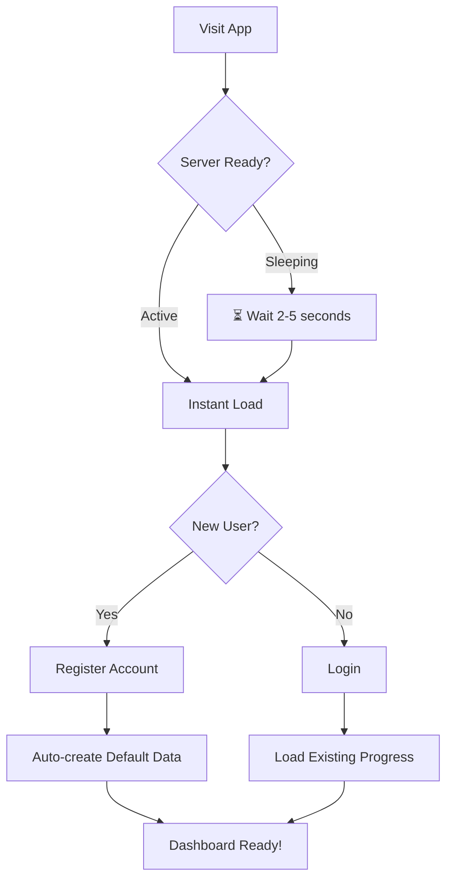
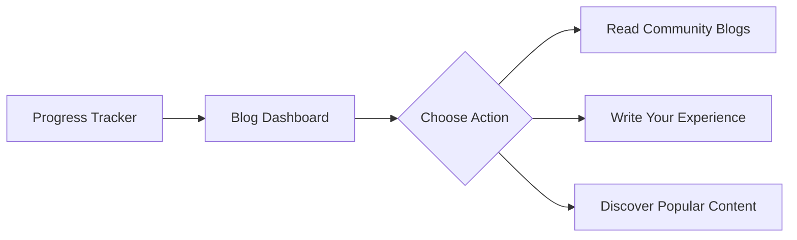
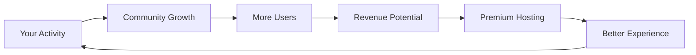

# FocusFlow - Track Your Progress, Master Your Journey 🌟

[](https://github.com/anupam6335/FocusFlow)
[](https://github.com/anupam6335/FocusFlow/releases)
[](https://daily-tracker-upst.onrender.com/)
[](LICENSE)
[](https://daily-tracker-upst.onrender.com/blogs)
[](https://render.com)

> **Transform Your Coding Journey into a Visual Masterpiece** 🎨

## ⏳ Important Note About Loading Times

<div align="center" style="background: #fff3cd; padding: 20px; border-radius: 10px; border-left: 4px solid #ffc107; margin: 20px 0;">

### 🐢 **Please Be Patient - We're Using Free Hosting!**

**We're currently running on Render's free tier, which means:**
- ⏰ **2-5 second initial load time** when the server is sleeping
- 🔄 **Automatic spin-up** after inactivity
- 💰 **Cost-effective** while we grow our community
- 🚀 **Future upgrade planned** to premium hosting

**What you might see during loading:**


**Don't worry!** This is completely normal. Just wait 2-5 seconds and your coding journey will begin! 🎯

</div>

---

A revolutionary full-stack platform that combines **daily progress tracking** with **community knowledge sharing**. Watch your skills grow day by day while building a portfolio of insights that helps others on their journey.

🌐 **Live Application: https://daily-tracker-upst.onrender.com/**

---

## 🎬 The Complete Workflow Journey

### 🚀 **Phase 1: Getting Started & Daily Tracking** (`index.html`)

#### **Step 1: First Visit & Authentication**


**What happens behind the scenes:**
- 🔐 **Secure Authentication**: JWT tokens with 230-day expiry
- 📦 **Data Initialization**: Pre-loaded with popular coding problems
- ☁️ **Auto-Sync**: Immediate cloud backup of your progress
- 🎨 **Theme Detection**: Automatic dark/light mode based on preference

#### **Step 2: Daily Progress Management**
**Your Daily Coding Ritual:**
```
📅 Day 15 - Today's Mission
├── ✅ Two Sum (LeetCode)
├── 🔄 Reverse Linked List  
├── 📚 System Design Basics
└── ➕ Add custom challenges...
```

**Interactive Features:**
- ✅ **One-click completion** with satisfying visual feedback
- 🔗 **Smart link tracking** - Click problem names to open directly
- 🏷️ **Color-coded tags** for categorization (Algorithms, Databases, etc.)
- 📝 **Inline editing** - Click any text to edit instantly
- 🗑️ **Safe deletion** with confirmation dialogs

#### **Step 3: Real-time Analytics & Motivation**
**Watch Your Progress Come Alive:**
```javascript
// Automatic analytics calculation
const achievements = {
  currentStreak: 7,        // 🔥 7 days straight!
  totalSolved: 45,         // 🏆 45 problems conquered
  averageDaily: 3.2,       // 📈 Consistent progress
  maxStreak: 12,           // 💪 Personal best
  heatmapData: {/*...*/}   // 🗓️ Visual consistency map
}
```

**Celebration Moments:**
- 🎉 **Achievement Popups** when hitting milestones (5+ problems/day)
- 🎊 **Confetti Animations** for major accomplishments  
- 📊 **Live Heatmap Updates** with every completion
- 🔄 **Auto-save** every 20 seconds + manual sync option

---

### 📝 **Phase 2: Knowledge Sharing & Community** (`blogs.html`)

#### **Step 4: Transition to Blog Platform**
**From Learner to Teacher:**


**Navigation Made Simple:**
- 📱 **Seamless Switching**: Single click between tracker and blogs
- 🔄 **Shared Authentication**: Same login works everywhere
- 💾 **Auto-save Drafts**: Never lose your writing progress
- 🌐 **Public/Private Control**: Share with world or keep personal

#### **Step 5: Creating Impactful Content**
**The Perfect Blog Creation Flow:**

1. **🚀 Start Creation**
   ```bash
   Click "Create Blog" → Rich Markdown Editor Opens
   ```

2. **📝 Write with Power**
   ```markdown
   # My Binary Search Breakthrough 🎯
   
   After solving 15+ variations, here's what I learned:
   
   ## Key Insights
   - **Pattern Recognition**: Identified 3 common templates
   - **Edge Cases**: Handling duplicates and empty arrays
   - **Performance**: O(log n) vs O(n) comparisons
   
   ## Code Example
   ```python
   def binary_search(arr, target):
       left, right = 0, len(arr)-1
       while left <= right:
           mid = (left + right) // 2
           # ... solution continues
   ```
   ```

3. **🏷️ Add Smart Metadata**
   - **Tags**: `binary-search, algorithms, python, beginners`
   - **Visibility**: Public 🌍 or Private 🔒
   - **Auto-slug**: URL-friendly title conversion

4. **✅ Publish & Share**
   - Instant availability at `/blogs/your-blog-slug`
   - Automatic view counting
   - Like system for community feedback

#### **Step 6: Community Engagement**
**Discover & Interact:**
```
📊 Blog Dashboard
├── 🔥 Popular Blogs (Trending)
│   ├── React Hooks Mastery (42 likes 👑)
│   └️ System Design Basics (38 likes ⭐)
├── 📚 All Blogs (Latest)
│   ├── My DFS Journey (15 likes)
│   └️ CSS Grid Tricks (22 likes)
└── 📖 My Blogs (Personal)
    ├── Published (3 blogs)
    └️ Drafts (1 in progress)
```

**Engagement Features:**
- ❤️ **Like System**: One-click appreciation (no self-liking!)
- 👁️ **View Tracking**: Real-time readership analytics  
- 🏆 **Popularity Algorithm**: `(likes + views) = popularity score`
- 📱 **Responsive Reading**: Perfect on all devices
- 🔍 **Smart Filtering**: By tags, popularity, recency

---

## 🛠️ Technical Deep Dive

### 🔄 **Real-time Sync Architecture**

```javascript
// Intelligent Conflict Resolution
class SyncEngine {
  async syncData() {
    // 1. Check for conflicts
    if (serverVersion > localVersion) {
      // 2. Smart merge instead of overwrite
      const merged = this.mergeIntelligently(serverData, localData);
      // 3. Preserve user's recent changes
      return this.preserveRecentCompletions(merged);
    }
    // 4. Push updates with version control
    await this.pushWithConflictDetection();
  }
}
```

**Sync Features:**
- ⚡ **Debounced Saving**: Prevents API spam during rapid typing
- 🔄 **Background Sync**: Every 20 seconds automatically
- 💾 **Offline Support**: Full functionality without internet
- 🛡️ **Conflict Resolution**: Never lose your progress

### 🎨 **User Experience Magic**

**Progressive Enhancement:**
```css
/* Smooth theme transitions */
:root {
  --bg-color: #0d1117;
  --text-color: #c9d1d9;
  --accent-color: #58a6ff;
  transition: all 0.3s ease-in-out;
}

/* Mobile-first responsive design */
@media (max-width: 768px) {
  .main-container { flex-direction: column; }
  .heatmap-grid { grid-template-columns: repeat(26, 10px); }
}
```

**Performance Optimizations:**
- 🚀 **Lazy Loading**: Blogs load on demand
- 💡 **Efficient Re-renders**: Only updated components refresh
- 📦 **Local Storage Caching**: Instant load after first visit
- 🎯 **Optimized Assets**: Minimal bundle size

---

## ⚡ **Hosting Information & Performance**

### 🆓 **Current Free Tier Setup**
```yaml
Hosting Provider: Render.com
Plan: Free Tier
Features:
  - 512MB RAM
  - Shared CPU
  - Automatic sleep after inactivity
  - Free SSL certificate
  - Custom domain support

Limitations:
  - ⏰ 2-5 second cold start
  - 📊 Limited concurrent users
  - 💾 1GB storage limit
```

### 🚀 **Future Upgrade Plan**
```yaml
Planned Upgrade: 
  - Premium hosting (AWS/Azure/DigitalOcean)
  - Instant loading times
  - Higher concurrent users
  - Advanced analytics
  - CDN integration
  - 99.9% uptime guarantee

Timeline: When we reach 1,000 active users! 🎯
```

### 🎯 **What This Means For You**

**During Development:**
```
✅ Your data is SAFE - MongoDB Atlas ensures persistence
✅ Your progress SYNCs - Once loaded, everything works perfectly  
✅ Your blogs PERSIST - All content is permanently stored
⏰ Initial load might take 2-5 seconds - Please be patient!
```

**Our Promise:**
> "We're committed to providing the best experience. The free hosting is temporary while we build our community. Every like, every blog, every user brings us closer to premium hosting!" 💪

---

## 🎯 **Complete User Journey Map**

### 👤 **For the Consistent Coder**
```
Monday:    ✅ Solve 3 problems → 📈 Streak extends to 5 days
Tuesday:   ✅ Solve 2 problems → 🎉 Hit 25 total solved milestone
Wednesday: 📝 Write blog about patterns learned → ❤️ Gets 15 likes
Thursday:  🔥 Discover popular blogs → 💡 Learn new optimization trick
Friday:    📊 Review weekly heatmap → 🎯 Plan next week's focus
```

### 👥 **For the Community Contributor**
```
Week 1:    Build 7-day streak, solve 20+ problems
Week 2:    Write first blog about breakthrough moment
Week 3:    Engage with community, like and learn from others
Week 4:    Become top contributor with popular blog posts
Ongoing:   Build reputation as thought leader in coding community
```

---

## 🚀 **Getting Started - Choose Your Path**

### 🟢 **Quick Start (5 Minutes + 5 Second Patience)**
1. **Visit** → https://daily-tracker-upst.onrender.com/
2. **Wait** → 2-5 seconds for server to wake up ⏰
3. **Register** → 30-second account creation
4. **Track** → Start with Day 1 problems
5. **Explore** → Check out the blog community

### 🔵 **Power User Path**
1. **Be Patient** → Understand the free tier limitations
2. **Deep Dive** → Use all tracking features daily
3. **Analyze** → Study your heatmap patterns  
4. **Share** → Write blogs about your learnings
5. **Engage** → Like and learn from community content

### 🟣 **Community Leader Path**
1. **Consistency** → Maintain impressive streaks
2. **Document** → Share every major breakthrough
3. **Engage** → Support other learners with likes
4. **Trend** → Create popular, valuable content
5. **Inspire** → Become a recognized voice in the community

---

## 📊 **Success Metrics & Growth Tracking**

### **Personal Growth Dashboard**
```javascript
const yourProgress = {
  consistency: "🔥 30-day streak",
  knowledge: "📚 15 blogs published", 
  impact: "❤️ 200+ likes received",
  community: "👥 500+ views on blogs",
  expertise: "🏆 Recognized in 3 categories"
}
```

### **Community Impact Scale**
```
Level 1: New Learner → Track progress consistently
Level 2: Active Member → Share first blog posts  
Level 3: Contributor → Create valuable content regularly
Level 4: Influencer → Blogs regularly trend in popular section
Level 5: Community Leader → Recognized expert with high engagement
```

---

## 🎉 **Why FocusFlow Transforms Learning**

### ✨ **The Magic Formula**
```
Daily Tracking + Community Sharing = Accelerated Growth

📈 Your Progress × 🤝 Community Wisdom = 🚀 Learning Velocity
```

### 🏆 **What You'll Achieve**
- **Visual Progress**: See your improvement in beautiful heatmaps
- **Knowledge Retention**: Writing blogs reinforces learning
- **Community Support**: Get motivation from fellow coders
- **Portfolio Building**: Create a public record of your journey
- **Career Advancement**: Demonstrate consistent learning habits

---

## 🔮 **Your Journey Starts Now**

### 🎯 **Immediate Next Steps**

1. **🚀 Launch the App** (Please be patient! ⏰)
   ```bash
   # Click this link and wait 2-5 seconds:
   https://daily-tracker-upst.onrender.com/
   ```

2. **📅 Complete Day 1**
   - Solve the pre-loaded problems
   - Experience the satisfaction of checking completions
   - Watch your analytics update in real-time

3. **📝 Plan Your First Blog**
   - What breakthrough did you have today?
   - What challenge did you overcome?
   - What would you tell your past self?

4. **🌐 Join the Community**
   - Explore what others are learning
   - Like content that helps you
   - Bookmark inspiring blogs

---

<div align="center">

## ⏳ **Important Reminder About Loading**

<div style="background: #e7f3ff; padding: 15px; border-radius: 8px; border: 2px dashed #4da8ff; margin: 20px 0;">

### 🐢 **Expect 2-5 Second Loading Times**

**This is what you might see initially:**


**Don't worry!** This is completely normal with our free hosting. 
**Just wait patiently** - your coding journey is worth the short wait! 🎯

**We promise:** Better hosting coming soon as our community grows! 🚀

</div>

## 🎊 Ready to Transform Your Coding Journey?

# [🚀 Start Tracking at https://daily-tracker-upst.onrender.com/](https://daily-tracker-upst.onrender.com/)

# [📝 Join Blog Community at /blogs](https://daily-tracker-upst.onrender.com/blogs)

**Your future self will thank you for starting today.** ✨

*"The best time to plant a tree was 20 years ago. The second best time is now."* - Chinese Proverb

</div>

---

## 💡 **Pro Tips for Maximum Impact**

### 🎯 **Tracking Excellence**
- **Set Daily Minimums**: Aim for at least 2 problems/day
- **Use Tags Wisely**: Categorize by technology and difficulty  
- **Review Weekly**: Study your heatmap every Sunday
- **Celebrate Milestones**: Take pride in every streak extension

### 📝 **Blogging Mastery**
- **Write Immediately**: Document insights while fresh
- **Focus on Value**: Solve specific problems for readers
- **Use Code Examples**: Make concepts concrete and actionable
- **Engage with Comments**: Build relationships with your audience

### 🔄 **Community Growth**
- **Like Generously**: Support fellow learners
- **Learn from Trends**: Study what makes blogs popular
- **Cross-pollinate**: Apply insights from blogs to your tracking
- **Pay It Forward**: Help newcomers get started

---

## 🤝 **Help Us Grow & Improve**

### 🎯 **Your Role in Our Upgrade**


**How you can help:**
- 📝 **Write valuable blogs** that attract new users
- ❤️ **Engage with content** to show active community
- 🔄 **Share with friends** who would benefit
- 💡 **Provide feedback** to help us improve

**Our commitment to you:**
> "We're investing every bit of growth back into better infrastructure. Your patience today means instant loading for everyone tomorrow!" 🚀

---

**🌟 Your coding legacy starts with one solved problem, one shared insight, one day at a time.** 

**What will you accomplish today?** 🚀

---

<div align="center" style="margin-top: 40px; padding: 20px; background: linear-gradient(135deg, #667eea 0%, #764ba2 100%); color: white; border-radius: 10px;">

## 💝 **Thank You for Your Patience!**

**We know waiting isn't fun, but we're building something amazing together.**

**Every second you wait helps us prove this platform is worth investing in!** 🚀

**[Click here to begin your journey →](https://daily-tracker-upst.onrender.com/)**

</div>
