# 🌿 FocusFlow - Complete System Architecture & API Flow Diagram

```mermaid
flowchart TB
    %% ========== USERS & ROLES ==========
    User[👤 User<br/>Anonymous/Logged-in]:::user
    Author[✍️ Blog Author<br/>Content Creator]:::author
    Admin[⚙️ System Admin<br/>Infrastructure]:::admin

    %% ========== FRONTEND INTERFACES ==========
    subgraph Frontend[🌐 Frontend Application - Single URL]
        Dashboard[index.html<br/>Progress Tracker Dashboard]:::frontend
        BlogPlatform[blogs.html<br/>Blog Management Platform]:::frontend
        BlogReader[blog-view.html<br/>Blog Reader & Viewer]:::frontend
        LocalStorage[💾 Local Storage<br/>Offline Cache & Sync Queue]:::storage
    end

    %% ========== BACKEND API LAYER ==========
    subgraph Backend[⚙️ Backend API - Express.js Server]
        AuthAPI[🔐 Authentication API]:::auth
        DataAPI[📊 Progress Data API]:::data
        BlogAPI[📝 Blog Management API]:::blog
        AnalyticsAPI[📈 Analytics API]:::analytics
        SyncEngine[🔄 Real-time Sync Engine]:::sync
    end

    %% ========== DATABASE COLLECTIONS ==========
    subgraph Database[🗄️ MongoDB Collections]
        Users[👥 Users Collection<br/>username, password, createdAt]:::dbUsers
        ProgressData[📊 Progress Data Collection<br/>userId, data, version]:::dbProgress
        Blogs[📝 Blogs Collection<br/>slug, author, content, likes]:::dbBlogs
        ActivityTracker[📈 Activity Tracker<br/>streaks, heatmap, history]:::dbAnalytics
        PasswordResets[🔐 Password Resets<br/>OTP codes, expiry]:::dbSecurity
    end

    %% ========== EXTERNAL SERVICES ==========
    subgraph Services[🔧 External Services & Libraries]
        JWT[jsonwebtoken<br/>JWT Token Generation]:::security
        Bcrypt[bcryptjs<br/>Password Hashing]:::security
        Marked[marked.js<br/>Markdown Processing]:::markdown
        DOMPurify[DOMPurify<br/>HTML Sanitization]:::security
        Mermaid[mermaid.js<br/>Diagram Rendering]:::markdown
        Highlight[highlight.js<br/>Syntax Highlighting]:::markdown
    end

    %% ========== AUTHENTICATION FLOW ==========
    subgraph AuthFlow[🔐 Authentication & Security Flow]
        A1[POST /api/register<br/>User Registration]:::endpoint
        A2[POST /api/login<br/>User Login]:::endpoint
        A3[GET /api/verify-token<br/>Token Validation]:::endpoint
        A4[POST /api/forgot-password<br/>Password Reset Request]:::endpoint
        A5[POST /api/reset-password<br/>Password Reset Complete]:::endpoint
        A6[POST /api/cleanup-reset-codes<br/>Expired Codes Cleanup]:::endpoint
    end

    %% ========== PROGRESS DATA FLOW ==========
    subgraph DataFlow[📊 Progress Data Management Flow]
        D1[GET /api/data<br/>Retrieve User Progress]:::endpoint
        D2[POST /api/data<br/>Save Progress with Sync]:::endpoint
        D3[POST /api/force-sync<br/>Manual Sync Trigger]:::endpoint
        D4[Conflict Resolution<br/>Version-based Merging]:::logic
        D5[Auto-save Debounce<br/>2-second Delay]:::logic
    end

    %% ========== BLOG MANAGEMENT FLOW ==========
    subgraph BlogFlow[📝 Blog Management Flow]
        B1[GET /api/blogs/all<br/>Public Blogs Paginated]:::endpoint
        B2[GET /api/blogs/my<br/>User's Blogs]:::endpoint
        B3[GET /api/blogs/popular<br/>Popularity Ranked]:::endpoint
        B4[GET /api/blogs/:slug<br/>Single Blog by Slug]:::endpoint
        B5[POST /api/blogs<br/>Create New Blog]:::endpoint
        B6[PUT /api/blogs/:slug<br/>Update Blog]:::endpoint
        B7[DELETE /api/blogs/:slug<br/>Delete Blog]:::endpoint
        B8[POST /api/blogs/:slug/like<br/>Like/Unlike]:::endpoint
        B9[POST /api/blogs/:slug/view<br/>Track Views]:::endpoint
        B10[Slug Generation<br/>Title → URL-friendly]:::logic
        B11[Popularity Scoring<br/>likes + views]:::logic
    end

    %% ========== ANALYTICS FLOW ==========
    subgraph AnalyticsFlow[📈 Analytics & Activity Flow]
        AN1[GET /api/activity-tracker<br/>Retrieve Analytics]:::endpoint
        AN2[POST /api/activity-tracker<br/>Save Analytics]:::endpoint
        AN3[Heatmap Calculation<br/>Daily Activity]:::logic
        AN4[Streak Analytics<br/>Current/Max Streaks]:::logic
        AN5[Progress Statistics<br/>Totals & Averages]:::logic
    end

    %% ========== USER INTERACTIONS ==========
    User -->|Visits App| Dashboard
    User -->|Manages Blogs| BlogPlatform
    User -->|Reads Content| BlogReader
    Author -->|Creates/Edits| BlogPlatform
    Admin -->|Monitors| Backend

    %% ========== FRONTEND TO BACKEND CONNECTIONS ==========
    Dashboard -->|API Calls| AuthAPI
    Dashboard -->|Progress Updates| DataAPI
    Dashboard -->|Analytics Data| AnalyticsAPI
    BlogPlatform -->|Blog Operations| BlogAPI
    BlogReader -->|View/Like Actions| BlogAPI
    LocalStorage -->|Background Sync| SyncEngine

    %% ========== BACKEND TO DATABASE CONNECTIONS ==========
    AuthAPI -->|User Management| Users
    AuthAPI -->|Reset Codes| PasswordResets
    DataAPI -->|Progress Storage| ProgressData
    BlogAPI -->|Blog Storage| Blogs
    AnalyticsAPI -->|Activity Data| ActivityTracker
    SyncEngine -->|Conflict Resolution| ProgressData

    %% ========== BACKEND TO EXTERNAL SERVICES ==========
    AuthAPI -->|Token Generation| JWT
    AuthAPI -->|Password Hashing| Bcrypt
    BlogAPI -->|Content Rendering| Marked
    BlogAPI -->|Content Sanitization| DOMPurify
    BlogReader -->|Diagram Support| Mermaid
    BlogReader -->|Code Highlighting| Highlight

    %% ========== AUTH FLOW CONNECTIONS ==========
    AuthAPI -->|Registration| A1
    AuthAPI -->|Login| A2
    AuthAPI -->|Token Verify| A3
    AuthAPI -->|Password Reset| A4 --> A5
    AuthAPI -->|Cleanup| A6

    %% ========== DATA FLOW CONNECTIONS ==========
    DataAPI -->|Retrieve Data| D1
    DataAPI -->|Save Data| D2 --> D4 --> D5
    DataAPI -->|Force Sync| D3
    SyncEngine -->|Auto-sync| D2

    %% ========== BLOG FLOW CONNECTIONS ==========
    BlogAPI -->|Public Blogs| B1
    BlogAPI -->|User Blogs| B2
    BlogAPI -->|Popular Blogs| B3 --> B11
    BlogAPI -->|Single Blog| B4 --> B9
    BlogAPI -->|Create Blog| B5 --> B10
    BlogAPI -->|Update Blog| B6
    BlogAPI -->|Delete Blog| B7
    BlogAPI -->|Engagement| B8

    %% ========== ANALYTICS FLOW CONNECTIONS ==========
    AnalyticsAPI -->|Get Analytics| AN1
    AnalyticsAPI -->|Save Analytics| AN2
    AnalyticsAPI -->|Heatmap| AN3
    AnalyticsAPI -->|Streaks| AN4
    AnalyticsAPI -->|Statistics| AN5

    %% ========== DATA RELATIONSHIPS ==========
    Users -.->|1:1| ProgressData
    Users -.->|1:Many| Blogs
    Users -.->|1:1| ActivityTracker
    Blogs -.->|Many:Many| Users[Likes]
    ProgressData -.->|Feeds| ActivityTracker

    %% ========== STYLING DEFINITIONS ==========
    classDef user fill:#4CAF50,color:white,stroke:#388E3C,stroke-width:2px
    classDef author fill:#2196F3,color:white,stroke:#1976D2,stroke-width:2px
    classDef admin fill:#9C27B0,color:white,stroke:#7B1FA2,stroke-width:2px
    classDef frontend fill:#FF9800,color:white,stroke:#F57C00,stroke-width:2px
    classDef backend fill:#607D8B,color:white,stroke:#455A64,stroke-width:2px
    classDef auth fill:#F44336,color:white,stroke:#D32F2F,stroke-width:2px
    classDef data fill:#3F51B5,color:white,stroke:#303F9F,stroke-width:2px
    classDef blog fill:#E91E63,color:white,stroke:#C2185B,stroke-width:2px
    classDef analytics fill:#00BCD4,color:white,stroke:#0097A7,stroke-width:2px
    classDef sync fill:#4CAF50,color:white,stroke:#388E3C,stroke-width:2px
    classDef storage fill:#795548,color:white,stroke:#5D4037,stroke-width:2px
    classDef dbUsers fill:#FF5722,color:white,stroke:#E64A19,stroke-width:2px
    classDef dbProgress fill:#2196F3,color:white,stroke:#1976D2,stroke-width:2px
    classDef dbBlogs fill:#9C27B0,color:white,stroke:#7B1FA2,stroke-width:2px
    classDef dbAnalytics fill:#00BCD4,color:white,stroke:#0097A7,stroke-width:2px
    classDef dbSecurity fill:#F44336,color:white,stroke:#D32F2F,stroke-width:2px
    classDef security fill:#F44336,color:white,stroke:#D32F2F,stroke-width:2px
    classDef markdown fill:#8BC34A,color:white,stroke:#689F38,stroke-width:2px
    classDef endpoint fill:#FF9800,color:black,stroke:#F57C00,stroke-width:2px
    classDef logic fill:#607D8B,color:white,stroke:#455A64,stroke-width:2px

    %% ========== ANIMATION STYLES ==========
    linkStyle default stroke:#666,stroke-width:2px
    linkStyle 0 stroke:#4CAF50,stroke-width:3px
    linkStyle 1 stroke:#4CAF50,stroke-width:3px
    linkStyle 2 stroke:#4CAF50,stroke-width:3px
    linkStyle 3 stroke:#2196F3,stroke-width:3px
    linkStyle 4 stroke:#9C27B0,stroke-width:3px
```



## 🔄 Detailed API Endpoint Flow Explanation

### **Authentication Endpoints Flow:**
```
👤 User Action → 🌐 Frontend → ⚙️ Auth API → 🗄️ Database → 🔧 Services → 📱 Response
    ↓              ↓            ↓            ↓            ↓            ↓
Register → POST /register → Users Collection → bcrypt.hash() → JWT Token → Success
Login → POST /login → User Lookup → bcrypt.compare() → JWT Generation → Token
Reset → POST /forgot-password → OTP Generation → PasswordResets → Email/SMS → OTP
Verify → GET /verify-token → JWT Validation → User Verification → Status → UI Update
```

### **Progress Data Endpoints Flow:**
```
📊 User Progress → 💾 Local Storage → 🔄 Sync Engine → 📊 Data API → 🗄️ ProgressData → 📈 Analytics
    ↓                 ↓                 ↓              ↓              ↓                 ↓
Add Question → Instant Save → Debounce (2s) → POST /data → Version Check → Update Heatmap
Complete Task → UI Update → Background Sync → Conflict Resolution → Save Data → Recalc Streaks
Edit Content → Auto-save → Manual Sync → PUT /data → Merge Logic → Activity History
```

### **Blog Management Endpoints Flow:**
```
✍️ Blog Creation → 📝 Blog API → 🔗 Slug Generation → 🗄️ Blogs Collection → 📊 Popularity → 🌐 UI Update
    ↓                 ↓              ↓                 ↓                   ↓              ↓
Write Content → POST /blogs → Title Processing → Save Document → Views + Likes → Blog Grid
Edit Blog → PUT /blogs/:slug → Slug Regeneration → Update Document → Recalc Score → Refresh
Like Blog → POST /like → Author Check → Update Array → Popularity Score → Heart Animation
View Blog → POST /view → Increment Counter → Update Count → Ranking Update → View Display
```

### **Analytics Endpoints Flow:**
```
📈 User Activity → 📊 Analytics API → 🧮 Calculations → 🗄️ ActivityTracker → 📊 Frontend → 🎯 Insights
    ↓                 ↓                 ↓              ↓                 ↓              ↓
Solve Problems → POST /activity-tracker → Streak Logic → Save Analytics → Heatmap → Progress Display
View Progress → GET /activity-tracker → Statistics Calc → Retrieve Data → Charts → Motivation
Sync Data → Background Process → Data Aggregation → Update Records → Real-time → Notifications
```

## 🎯 Key System Interactions

### **Real-time Sync Process:**
```
1. User makes change → 2. LocalStorage update → 3. Debounce timer (2s)
    ↓
4. POST /api/data → 5. Version conflict check → 6. Auto-merge compatible changes
    ↓
7. Manual resolution prompt (if needed) → 8. Database update → 9. UI refresh
```

### **Blog Popularity Ranking:**
```
Blog Engagement → Views Counter + Like System → Popularity Score = (views + likes)
    ↓
GET /api/blogs/popular → Sort by Popularity Score → Return ranked results
    ↓
Frontend display → Higher engagement = Better ranking → Community discovery
```

### **Authentication Security Flow:**
```
User Credentials → bcrypt Password Hashing → JWT Token Generation (230-day expiry)
    ↓
API Requests → Bearer Token Validation → User Permission Check → Data Access
    ↓
Password Reset → OTP Generation (15-min expiry) → Secure Reset Process → Account Recovery
```

This comprehensive diagram shows how all 25+ API endpoints work together in the FocusFlow ecosystem, from user authentication to real-time progress tracking and community blogging features.
